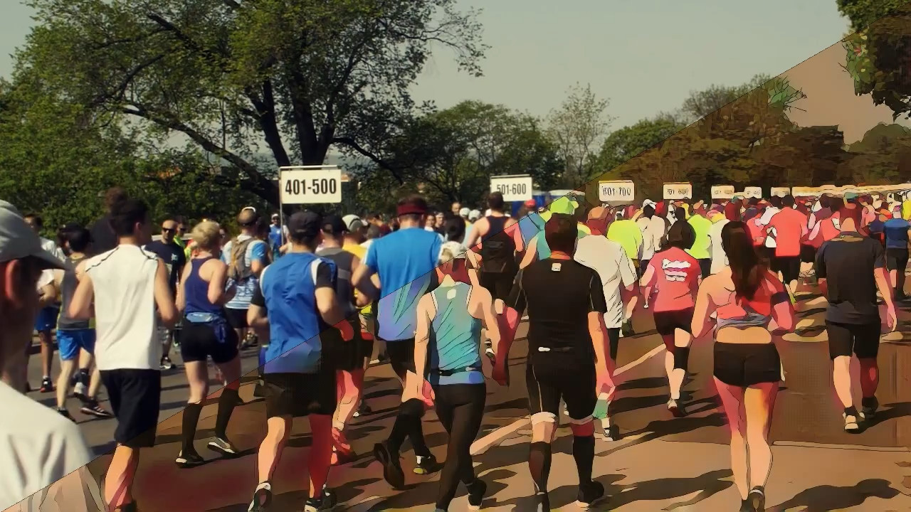
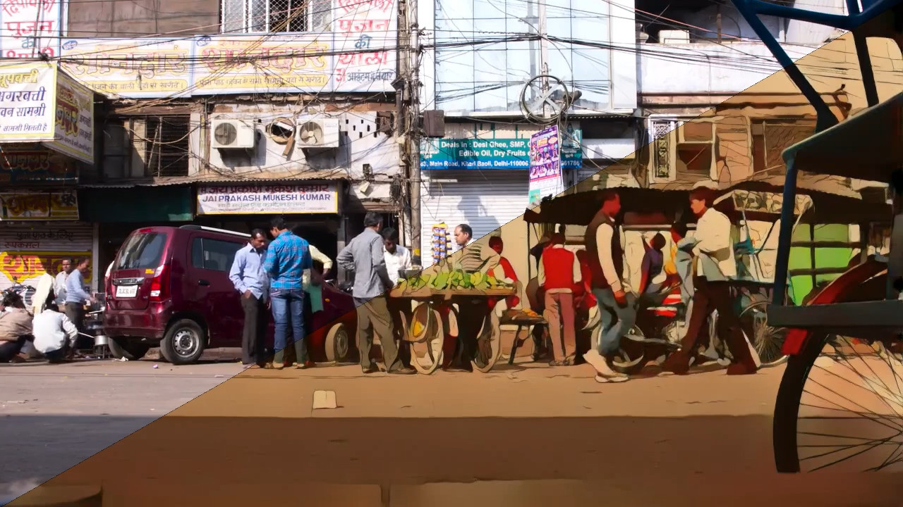
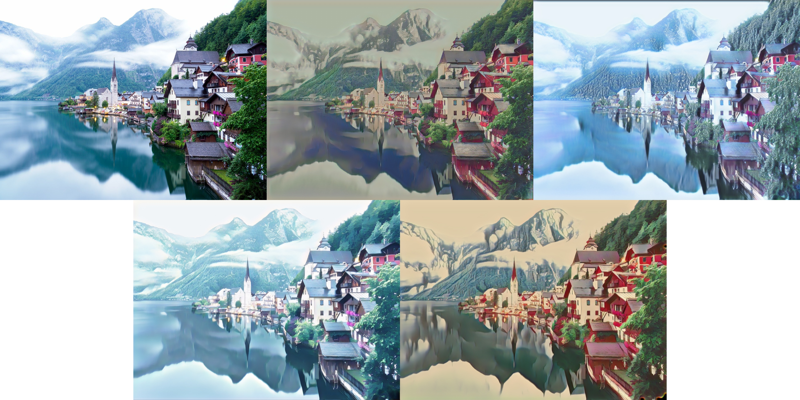
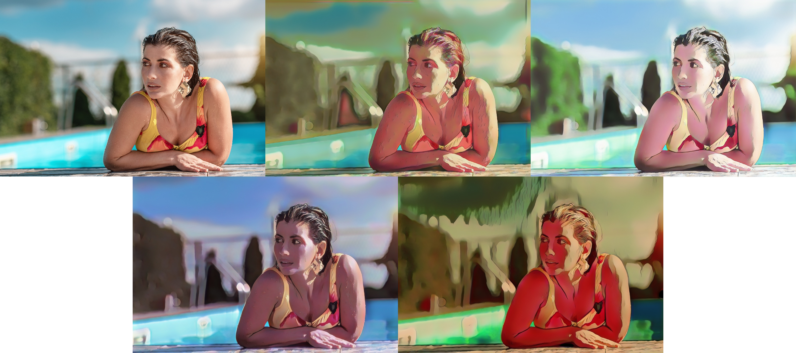

# Video2Cartoon

Create cartoon versions of your videos (and images) using CartoonGAN and OpenCV. The code is based on the CartoonGAN <a href="https://openaccess.thecvf.com/content_cvpr_2018/CameraReady/2205.pdf" rel="nofollow">paper</a> of Chen et al. and the PyTorch <a href="https://github.com/Yijunmaverick/CartoonGAN-Test-Pytorch-Torch" rel="nofollow">implementation</a> of Yijun Li.

The following still frame shows the original video on the left and the Hayao style cartoon version on the right. The corresponding video showcasing all 4 cartoon styles (Hayao, Shinkai, Hosoda, Paprika) is available in ```media/marathon.mp4```. The original video can be downloaded from <a href="https://pixabay.com/videos/marathon-marathon-runners-running-15741/" rel="nofollow">here</a>.

<p>
    
</p>

## Requirements

- Python 3
- PyTorch
- OpenCV
- Numpy

This code has been tested with Python 3.8, PyTorch 1.9.0, OpenCV 4.5.5.62 and Numpy 1.19.2. You also need to have the chosen codec installed in your system in order to produce videos. The default codec is DIVX, but you can specify any other codec using the ```--video_codec``` parameter.

## How to run

Download the code and open a terminal / command prompt inside the Video2Cartoon directory. Run:
```
python video2cartoon.py -h
```
to familiarize yourself with all the available options and make the most out of this code. The most important options are:

- ```--style``` which determines the cartoon style to use. Available options are Hayao, Shinkai, Hosoda and Paprika. The first time you run each style, the code automatically downloads the corresponding network weights and places them inside the ```model_weights``` directory, which is created if not present.
- ```--reduce_ratio``` which allows resizing the input. This is particularly useful if your system runs out of memory when processing the input.
- ```--video_codec``` which determines the codec to use when creating videos.

To execute the program on an input video, reduce its width and height by half and use the Hosoda style, simply run:

```
python video2cartoon.py path_to_video --style Hosoda --reduce_ratio 0.5
```

The new video will have the same fps as the original. To execute the program on an image, the process is exactly the same:

```
python video2cartoon.py path_to_image
```

You don't need to have a modern GPU to run the program, but it is recommended when processing videos. The code automatically detects if a suitable GPU is present in order to speed up the computations. If not, all computations take place in the CPU / system RAM.

## Results

Below is a still frame from ```media/India.mp4``` showing the original video on the left and the Paprika style cartoon on the right. The original video can be downloaded from <a href="https://pixabay.com/videos/india-street-busy-rickshaw-people-3175/" rel="nofollow">here</a>.

<p>
    
</p>

The following compositions (available in ```media/lake_comp.jpg``` and ```media/woman_comp.jpg```) show the original image on the top left, the Hayao and Hosoda styles on the top center and top right, and the Shinkai and Paprika styles on the bottom left and bottom right. The original images can be downloaded from <a href="https://pixabay.com/photos/lake-fog-mountains-tourism-travel-6975332/" rel="nofollow">here</a> and <a href="https://pixabay.com/photos/woman-swim-model-swimsuit-6361651/" rel="nofollow">here</a>.

<p>
    
    
</p>

## License

This work, as well as the original work by Yijun Li, is under the MIT License.
